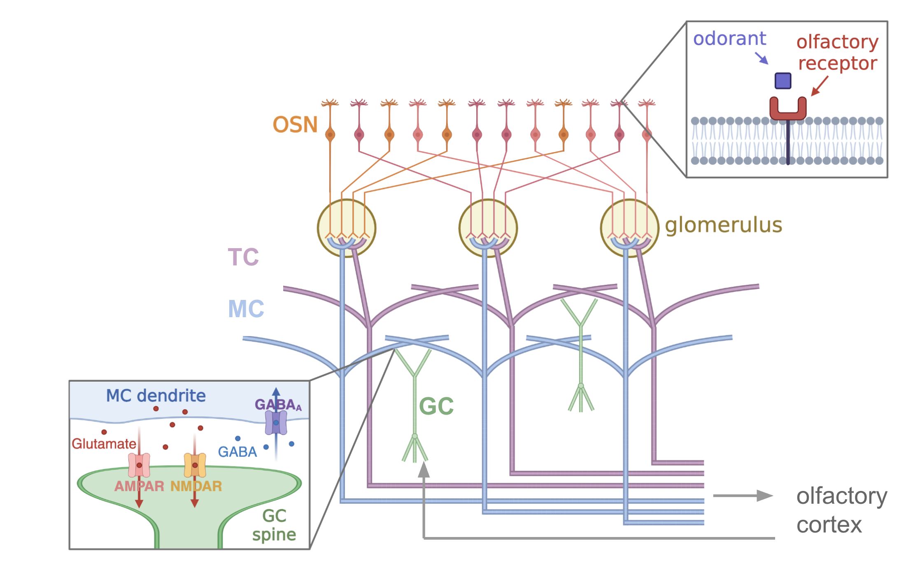
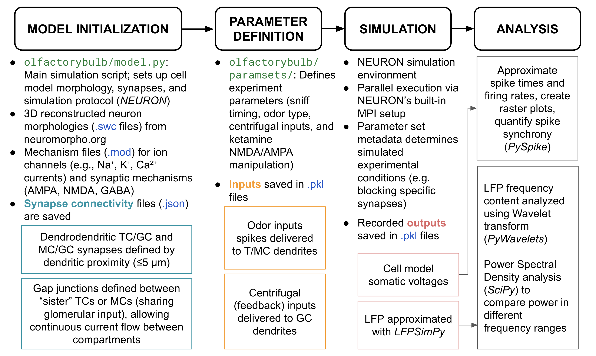
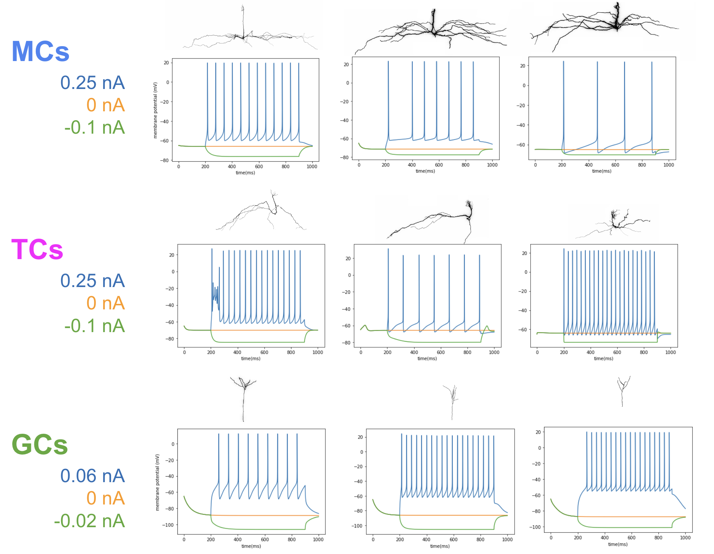
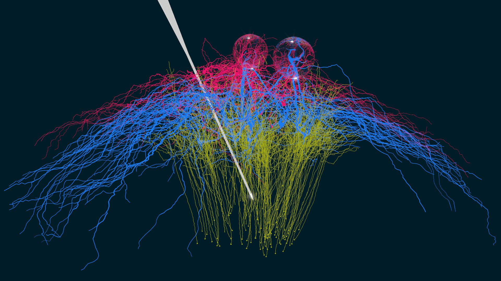
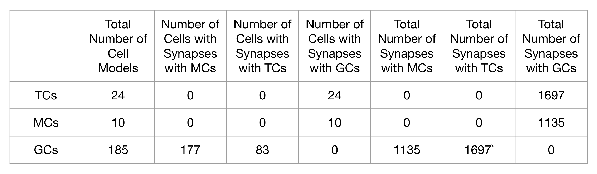
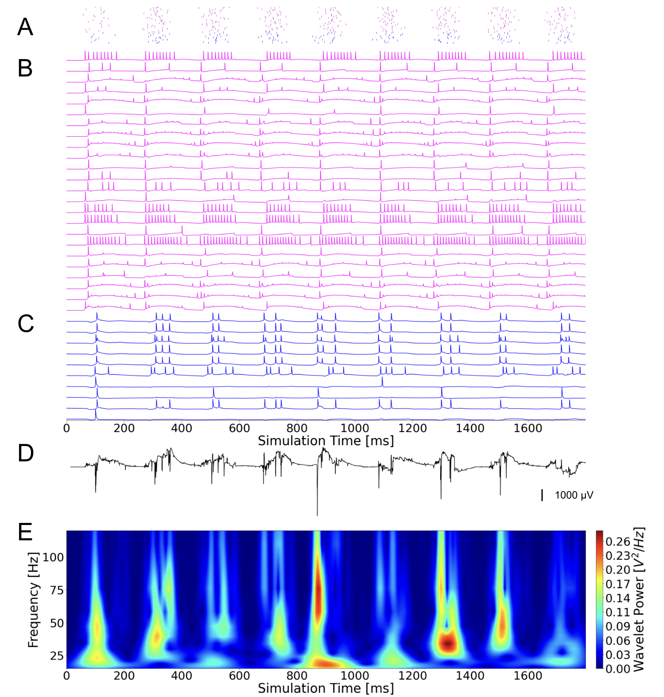
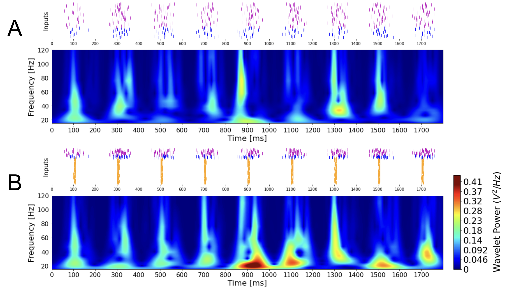
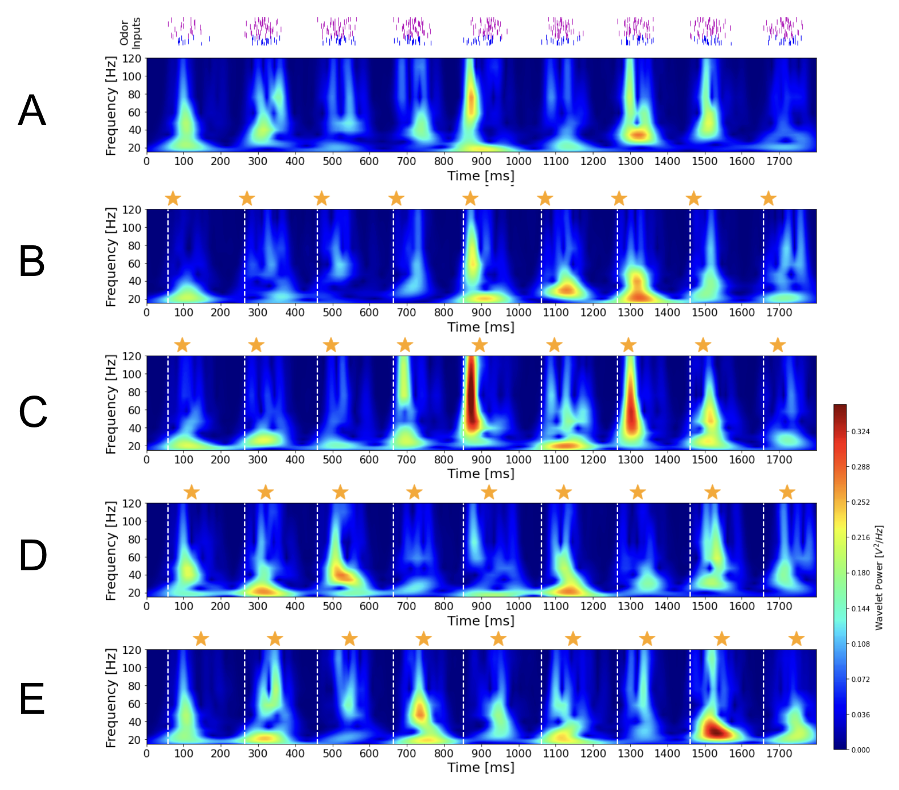
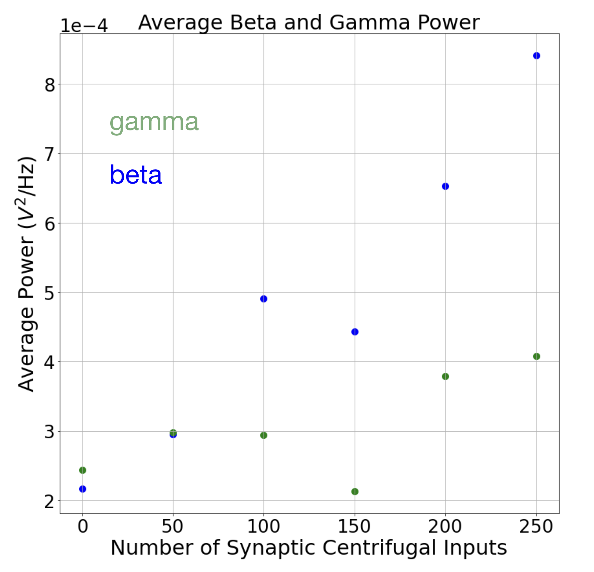
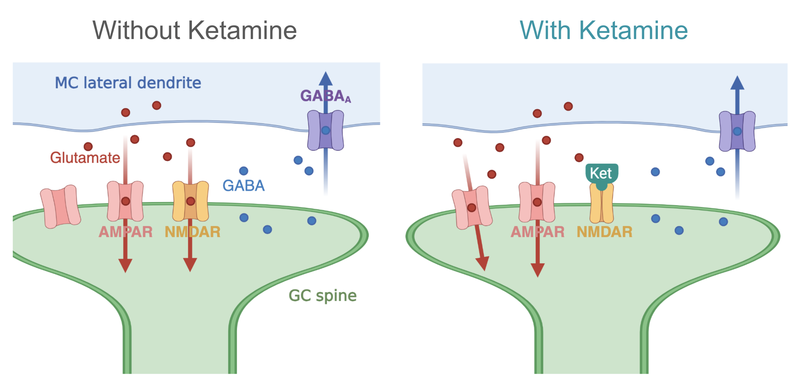

# Olfactory Bulb Model

This repository contains code and analysis for simulating the olfactory bulb network. It is based on the original [JustasB/OlfactoryBulb](https://github.com/JustasB/OlfactoryBulb) repository, with additional manipulations and analysis methods.

The model simulates a subcircuit of the mouse main olfactory bulb containing tufted cells (TCs), mitral cells (MCs), and granule cells (GCs) with realistic three-dimensional morphologies and connectivity. It serves as a platform for *in silico* physiology experiments examining oscillatory dynamics, synaptic mechanisms, and pharmacological manipulations.


*Olfactory bulb circuitry showing the major cell types and their connections.*

---

## Folder Structure

```
OlfactoryBulb-1/
├── scripts/                 # All Python scripts
│   ├── stft.py              # Short-time Fourier transform analysis
│   ├── wavelet.py           # Wavelet transform analysis for LFP
│   ├── lfp_analysis.py      # LFP analysis utilities
│   └── ...                  # Other analysis and utility scripts
├── notebooks/               # Jupyter notebooks for exploration and analysis
│   ├── fitting/             # Fitting and validation notebooks
│   │   ├── fitting-GC.ipynb
│   │   ├── fitting-TC.ipynb
│   │   └── ...
│   └── ...                  # Other notebooks
├── olfactorybulb/          # Core model implementation
│   ├── model.py            # Main model definition
│   ├── paramsets/          # Parameter sets and configurations
│   │   ├── base.py         # Base parameters
│   │   └── case_studies.py # Specific experimental configurations
│   └── slicebuilder/       # Network construction utilities
├── results_v1_subcircuit/   # Simulation results and output files
├── readme_figs/             # Figures used in this README
└── ...                      # Other folders (prev_ob_models, etc.)
```

---

## Workflow Overview



This figure shows the main workflow for simulation, analysis, and figure generation.

---

## Model Components

### Cell Types
The model includes three main cell types:
- **Tufted Cells (TCs)**: Excitatory projection neurons with three morphological variants (TC1, TC2, TC3)
- **Mitral Cells (MCs)**: Excitatory projection neurons with three morphological variants (MC1, MC2, MC3)
- **Granule Cells (GCs)**: GABAergic inhibitory interneurons with three morphological variants (GC1, GC2, GC3)

Cell models are based on realistic morphologies and use multi-compartment Hodgkin-Huxley dynamics implemented in NEURON.


*Current clamp recordings from individual cell models showing voltage responses to current injection, demonstrating intrinsic electrophysiological properties of each cell type variant.*

### Synaptic Connections

The model implements several types of synaptic connections:

#### 1. Dendrodendritic Reciprocal Synapses (TC/MC ↔ GC)
- **Location**: GC dendrites in the External Plexiform Layer (EPL)
- **Excitatory component**: AMPA/NMDA receptors on GC dendrites (from TC/MC)
- **Inhibitory component**: GABA receptors on TC/MC dendrites (from GC)
- **Implementation**: `ampanmdasyn.mod` mechanism for AMPA/NMDA dynamics
- **Key functions**: Synapse placement based on dendritic proximity in `model.py`
- **Files**: Synapse information saved in `.json` files for later instantiation

#### 2. Gap Junctions (Electrical Synapses)
- **TC-TC gap junctions**: Connect pairs of sister tufted cells from the same glomerulus
- **MC-MC gap junctions**: Connect pairs of sister mitral cells from the same glomerulus
- **Implementation**: Each principal cell connected to two other siblings of same type
- **Key function**: `add_gap_junctions()` in `olfactorybulb/model.py`
- **Modulation**: Can be blocked by setting maximum conductance to zero

#### 3. Odor Inputs
- **Target**: TC and MC apical dendrites in glomerular layer
- **Implementation**: Excitatory spike trains based on experimental odor response patterns, with spikes delivered to excitatory synapses placed in each TC or MC’s apical dendrites
- **Patterns**: Different odor stimuli ('Apple', 'Pear', etc.) with distinct spatiotemporal profiles based on optical glomerular imaging experiments (Vincis et al., 2012). Stimulation of glomeruli with realistic activation patterns follow the methods of previous modeling work (Migliore et al., 2014). 
- **Timing**: The odor input spike times are chosen from a Gaussian distribution with the spike train length corresponding to the inhalation duration. Inhale and exhale durations mimic realistic sniff timing, with inhale duration of 125 ms and a sniff rate of 5 Hz (Manabe and Mori, 2013). The maximum frequency for the inputs is 150 Hz, the maximum firing rate of OSNs (Duchamp-Viret et al., 2000).

#### 4. Centrifugal Feedback Inputs
- **Target**: Granule cell dendrites in the Granule Cell Layer (GCL)
- **Source**: Simulates feedback from piriform cortex and other downstream regions (Boyd et al., 2012; Markopoulos et al., 2012)
- **Effect**: Modulates beta oscillations by increasing GC excitability
- **Key function**: `add_centrifugal_inputs()` in `olfactorybulb/model.py`
- **Parameters**: Timing, strength, and interval of inputs can be varied


*Biophysically realistic subcircuit model showing the spatial organization of TCs, MCs, and GCs with their dendritic arbors and synaptic connections. The simulated LFP electrode placement in the GCL is also indicated.*


*Summary table showing the total number of synapses between each cell type in the olfactory bulb subcircuit model.*

---

## Analysis Workflows

### 1. Local Field Potential (LFP) Analysis

#### Recording and Preprocessing
- **Recording location**: Simulated electrode in Granule Cell Layer (GCL)
- **Sampling rate**: 10 kHz (0.1 ms resolution)
- **Library**: LFPsimpy for extracellular potential calculation
- **Method**: Line source approximation for LFP from transmembrane currents

#### Bandpass Filtering
- **Filter type**: Butterworth bandpass filter (`sosfiltfilt`)
- **Filter order**: 6 (balances frequency separation and signal retention)
- **Key frequency ranges**:
  - Beta: 15-30 Hz
  - Gamma: 30-120 Hz
  - High Frequency Oscillations (HFO): 120-200 Hz
- **Low-pass filter**: <200 Hz to remove high-frequency noise
- **Script**: `scripts/lfp_analysis.py`

#### Wavelet Analysis and Scalograms
Wavelet transforms provide superior time-frequency resolution for analyzing rapidly changing neural signals.

**Wavelet Parameters** (optimized to minimize spectral smearing):
- **For frequencies <130 Hz**:
  - Wavelet type: `cmor1.5-1.0` (complex Morlet)
  - Number of scales: 50
  - Frequency range: ~5-130 Hz
  
- **For frequencies >130 Hz**:
  - Wavelet type: `cmor2.5-2.5` (complex Morlet)
  - Number of scales: 100
  - Frequency range: 130-300 Hz

**Analysis Steps**:
1. Apply continuous wavelet transform using PyWavelets
2. Calculate power: log transform of wavelet coefficient magnitudes
3. Generate scalograms (time-frequency maps) using matplotlib `contourf`
4. Quantify power in specific frequency bands

**Key Script**: `scripts/wavelet.py`

#### Comparing Beta and Gamma Power
- Calculate average power spectral density (PSD) in beta (15-30 Hz) and gamma (30-120 Hz) ranges
- Compare relative oscillation strength across conditions
- Assess effects of gap junction blockade, centrifugal inputs, or ketamine

**Visualization**: Scalograms show power changes across simulation time and frequency


*Example output of the olfactory bulb subcircuit model in response to odor inputs. Top: Simulated odor spike inputs to TCs and MCs. Middle: Somatic voltage traces for TC and MC populations showing synchronized activity. Bottom: Simulated LFP signal and scalogram showing power in beta and gamma frequency ranges across sniff cycles.*

### 2. Spike Analysis and Synchrony Quantification

#### Spike Detection
- **Threshold**: Somatic voltage crossing 0 mV (from below)
- **Output**: Spike times for each cell
- **Visualization**: Raster plots grouped by cell type (TC: magenta, MC: blue, GC: orange)

#### Firing Rate Analysis
- **Instantaneous firing rates**: Calculated using Gaussian smoothing
- **Function**: `scipy.ndimage.gaussian_filter1d`
- **Sigma values**:
  - 25 ms: For full simulation analysis across multiple sniffs
  - 10 ms: For within-sniff dynamics (finer temporal resolution)
- **Purpose**: Identify peaks of synchronized activity for each cell type

#### Spike Synchrony Metrics
- **Within-population synchrony**: Correlation of spike times within TC or MC populations
- **Cross-population timing**: TCs fire before MCs within each sniff cycle
- **Phase-locking**: Activity synchronized to simulated sniff rate (~5 Hz)

**Key outputs**:
- Average firing rates by cell type
- Population synchrony indices
- Spike timing differences between TCs and MCs

### 3. Power Spectral Analysis

#### Calculating Power Spectral Density
- Extract power in specific frequency bands from wavelet-transformed LFP
- Average power across time windows (e.g., during odor presentation)
- Compare across experimental conditions

#### Comparing Conditions
- **Gap junction blockade**: Effects on TC vs MC synchrony
- **Centrifugal input strength**: Beta vs gamma power modulation
- **Ketamine effects**: Changes in gamma and HFO power

**Statistical comparisons**: Tables reporting average power changes with pharmacological manipulations

---

## Key Analysis Scripts

### `scripts/wavelet.py`
- Implements continuous wavelet transforms
- Generates scalograms with optimal time-frequency resolution
- Configurable wavelet types and scale parameters
- Calculates power spectral densities

### `scripts/lfp_analysis.py`
- LFP preprocessing and filtering
- Bandpass filtering with Butterworth filters
- Power extraction in specific frequency bands
- Visualization utilities for LFP signals

### `scripts/stft.py`
- Short-time Fourier transform implementation
- Alternative to wavelet analysis (fixed window)
- Useful for comparison with wavelet methods

---

## Experimental Manipulations

### Blocking Gap Junctions
**Purpose**: Assess role of electrical coupling in network synchrony

**Implementation**:
- Set gap junction conductance to zero in `model.py`
- Separate manipulations for TC-TC and MC-MC gap junctions

**Key Findings**:
- Blocking TC gap junctions disrupts TC synchrony but not MC synchrony
- Blocking MC gap junctions disrupts MC synchrony but not TC synchrony
- Demonstrates independent synchronization mechanisms in each subnetwork

### Varying Centrifugal Input Parameters
**Purpose**: Understand how feedback modulates beta and gamma oscillations

**Manipulable parameters**:
- **Timing**: Onset relative to odor input
- **Strength**: Synaptic weight of feedback inputs
- **Interval**: Frequency of recurring inputs

**Key Findings**:
- Centrifugal inputs strengthen beta oscillations
- Effects depend on GC excitability
- Timing relative to sniff cycle affects efficacy


*Comparison of LFP scalograms showing oscillatory dynamics with odor inputs alone (left) versus with added centrifugal inputs to granule cells (right), demonstrating enhanced beta oscillation power.*


*Example of varying centrifugal input parameters: LFP scalograms showing the effect of different delays (timing of centrifugal input onset relative to odor input onset) on oscillatory power across frequency bands.*


*Average beta (15-30 Hz) and gamma (30-120 Hz) power during inhale portions of sniffs as a function of centrifugal input strength. Input strength is varied by increasing the number of GC dendritic segments receiving excitatory feedback, showing differential modulation of beta versus gamma oscillations.*

### Inhibitory Strength Modulation
**Purpose**: Examine how GABAergic inhibition affects oscillations

**Implementation**:
- Vary GABA conductance (`gaba_gmax` parameter)
- Test low, medium, and high inhibition levels

**Effects**:
- Changes gamma oscillation power
- Modulates TC/MC firing patterns
- Interacts with ketamine effects on HFO

---

## Simulation and Visualization

### Running Simulations
- **Platform**: NEURON simulator with Python interface
- **Parallelization**: MPI support for distributed computing
- **Output files**: `.pkl` files containing spike times, voltages, and LFP
- **Configuration**: Parameter sets in `olfactorybulb/paramsets/`

### Visualization Outputs
- **Voltage traces**: Somatic membrane potentials over time
- **Spike rasters**: Population activity patterns
- **LFP plots**: Filtered signals in specific frequency bands
- **Scalograms**: Time-frequency power maps
- **Power spectra**: Frequency-domain analysis of oscillations

---

## Parameter Configuration

### Key Parameter Files

**`olfactorybulb/paramsets/base.py`**
- Default network parameters
- Cell intrinsic properties
- Baseline synaptic conductances

**`olfactorybulb/paramsets/case_studies.py`**
- Experimental condition configurations
- Gap junction manipulations
- Centrifugal input parameters
- Ketamine simulation parameters

### Adjustable Parameters

**Synaptic parameters**:
- `gaba_gmax`: GABA synapse maximum conductance
- `ampa_nmda_gmax`: AMPA/NMDA synapse maximum conductance
- `mc_gj_gmax`: MC gap junction maximum conductance
- `tc_gj_gmax`: TC gap junction maximum conductance

**Simulation parameters**:
- `setup_time`: Initialization period before odor inputs
- `sniff_rate`: Frequency of odor input cycles (~5 Hz)
- `max_firing_rate`: Maximum frequency of input spike trains

**Ketamine parameters**:
- `nmda_toggle`: NMDA conductance scaling (0-1)
- AMPA scaling factor for homeostatic compensation

---

## Results Organization

### `results_v1_subcircuit/`
Contains simulation outputs organized by experiment:
- Voltage traces (`.pkl` files)
- Spike times (`.pkl` files)
- LFP signals (`.pkl` files)
- Analysis figures (`.jpg`, `.pdf` files)
- Parameter configurations (`.yml` files)

---

## Pharmacological Manipulations

### Simulating Ketamine Administration

Ketamine acts as an NMDA receptor antagonist. The model simulates this through:


*Schematic showing how ketamine affects the dendrodendritic synapse between TCs/MCs and GCs, blocking NMDA receptors while potentially causing compensatory upregulation of AMPA receptors.*

1. **NMDAR Blockade**: Reducing NMDA conductance by multiplying by a scalar factor (<1)
   - **Implementation**: Modify `gnmda` in `ampanmdasyn.mod`
   - **Effect**: `inmda = gnmda*(v - E)` results in decreased NMDA current

2. **Compensatory AMPAR Upregulation**: Optionally increase AMPA conductance
   - Simulates homeostatic plasticity observed experimentally

3. **Key Parameters**:
   - NMDA toggle factor: 0 (complete block) to 1 (no block)
   - AMPA scaling factor: >1 for increased AMPAR activity

4. **Effects on Network**:
   - Increases TC/MC firing rates
   - Decreases GC firing rates
   - Modest increases in high-frequency oscillation (HFO) power
   - Complex effects on gamma oscillations

**Configuration files**: `olfactorybulb/paramsets/case_studies.py`

---

## References

### Model Based On:
- **Original repository**: [JustasB/OlfactoryBulb](https://github.com/JustasB/OlfactoryBulb)
- **Publication**: Birgiolas et al. (2020) "Inhibitory microcircuits affect the signal processing of cortex-bound and cortex-originated information differently in the olfactory bulb"

### Key Methods:
- **LFP simulation**: LFPsimpy library
- **Wavelet analysis**: PyWavelets library
- **Neural simulation**: NEURON simulator
- **Morphologies**: Realistic cell reconstructions from experimental data

### Related Work:
For detailed methodology, experimental validation, and scientific findings, see Smith (2025) "Oscillations in a Computational Subcircuit Model of the Rodent Olfactory Bulb" (Doctoral Dissertation, Arizona State University).

---

## Additional Notes

- Notebooks in `notebooks/fitting/` are organized for parameter fitting and validation.
- `results_v1_subcircuit/` contains simulation outputs; large files such as `.pkl` are included as examples.
- All Python scripts are in `scripts/` and are referenced in notebooks via `sys.path.append("../scripts")`.
- For questions about specific analyses or to request additional documentation, please open an issue.

---

## Citation

If you use this model in your research, please cite:

```
Smith, E. (2025). Oscillations in a Computational Subcircuit Model of the Rodent 
Olfactory Bulb. Doctoral Dissertation, Arizona State University.

Birgiolas, J., Hayden, D., Mart, G., and Crook, S.M. (2020). Inhibitory microcircuits 
affect the signal processing of cortex-bound and cortex-originated information 
differently in the olfactory bulb.
```
